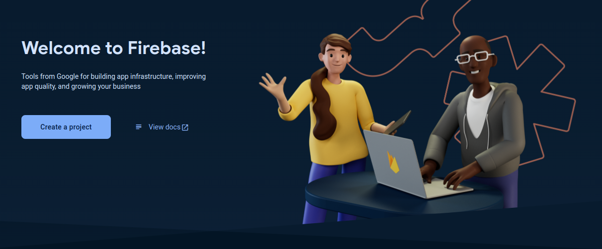

<!-- @auhor @AdriAir -->

# Proyecto de investigación: Firebase & Cypress

## Introducción

Para este proyecto de investigación realizaremos la creación de una aplicación web la cual utilizará las herramientas de Google Firebase, las cuales incluyen desde herramientas de autenticación hasta la própia base de datos, con Firesore, y hosting.

Además de eso, aprenderemos a aplicar testing con Cypress en nuestro proyecto de Node.js, para ello abriremos las tripas de la misma app usada para el despliegue con Firebase.

## Firebase

Google Firebase es una plataforma de desarrollo de aplicaciones móviles y web que ofrece una variedad de herramientas y servicios para ayudar a los desarrolladores a crear, mejorar y hacer crecer sus aplicaciones. Firebase proporciona una infraestructura completa para el desarrollo de aplicaciones, incluyendo servicios de backend, bases de datos en tiempo real, almacenamiento en la nube, autenticación de usuarios, análisis, mensajería en la nube, pruebas de aplicaciones... También proporciona herramientas para el desarrollo de videojuegos en Unity o en C++.

En este caso utilizaremos Firebase para realizar el despliegue de una aplicación web con **Vite**.

### Creación de un proyecto

En primer lugar, antes de comenzar en local, tendremos que crear un proyecto en la nube. Para ello, utilizaremos la web de [Firebase](https://firebase.google.com/).


Una vez iniciemos sesión, podremos acceder a nuestro gestor de proyectos:



Al comenzar a crear un proyecto, se nos pedirá el nombre del mismo, además de un ID único para identificar la web:


Google firebase, además, nos permite utilizar **Google Analytics** con nuestra web, para el analisis de datos sobre el tráfico, interacciones...


Se nos preguntará sobre que cuenta queremos gestionar los anális de firebase:


Entonces comenzará a generarse el proyecto:


Finalmente, aparecerá el panel de control del proyecto:


Ahora crearemos la app de firebase, podemos crear cualquiera de las siguientes aplicaciones:


En nuestro caso, crearemos una aplicación web.

Al comienzo, necesitamos un nombre:


Las instrucciones para generar y configurar inicialmente la aplicación aparecerán:


### Implementación en NodeJS

Primero, descargamos el CLI de Firebase, en mi caso la instalaré como dependencia de desarrollo:

```bash
npm i -D firebase-tools
```

En caso de querer instalarla de forma global:

```bash
npm i -g firebase-tools
```

Para poder asociar nuestra aplicación al proyecto de **Firebase**, tendremos que iniciar sesión. Para ello, usaremos el siguiente comando:

```bash
npx firebase login
```

Esto abrirá nuestro navegador:


Una vez iniciarmos sesión con nuestra cuenta de google, la cual debe tener acceso al proyecto de firebase, podremos continuar en nuestra terminal.


En caso de utilizar un framework, debemos activar una función expermental:

```bash
npx firebase experiments:enable webframeworks
```

Inicializamos un proyecto con:

```bash
npx firebase init hosting
```

Entonces, podremos usar la aplicación que creamos anteriormente:


Especificamos configuraciones varias como el framework:


También configuraremos la región del servidor de despliegue:


Tendremos que importar el SDK de Firebase utilizando:

```bash
cd ./project-name
npm i firebase
```

Finalmente, en nuestro archivo **main.ts**, conectaremos la apliación con firebase:


### Implementar autenticación

La autenticación con Firebase facilita el registro y el inicio de sesión a nuestra aplicación de forma rápida y sencilla.

En nuestro caso, vamos a realizar el inicio de sessión con google, pero antes de comenzar, tendremos que activar el proveedor:

Entramos en **Build -> Authentication**


Un vez, ahí, en la sección de **Sign-in method** activamos los proveedores que necesitemos, en nuestro caso, **Google**:


Hemos creado una función que nos permite iniciar sesión con google al pulsar un botón, además de mostrar nuestros datos:


### Base de datos: Firestore

#### Creación de la base de datos

#### ¿Consultas sobre la base de datos NoSQL Documental?

#### Reglas de seguridad

### Despliegue del proyecto

## Cypress

## Bibliografia

[Firebase - Documentación](https://firebase.google.com/docs)

[Firebase - Introducción a Firestore](https://firebase.google.com/docs/firestore/quickstart)

[Youtube - Empezar con Firebase y la web](https://www.youtube.com/watch?v=vjfzXNGG66k)

---

[Cypress - Documentación](https://docs.cypress.io/guides/overview/why-cypress)

---
